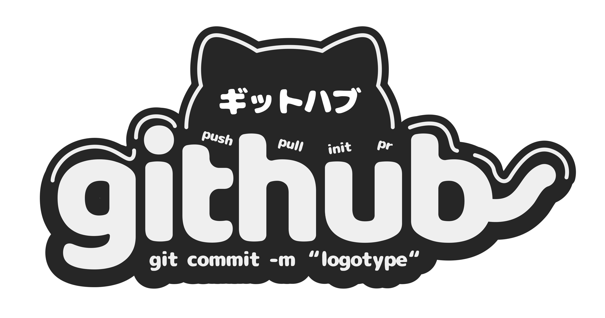

<div align="center">
  
</div>

<h1 align="center" style="font-weight: bold;">Super Portfolio 💻</h1>

<p align="center">
<a href="#tech">Technologies</a> |
<a href="#started">Getting Started</a> |
<a href="#colab">Collaborators</a> |
<a href="#contribute">Contribute</a>
</p>

<p align="center">⚡ Build your timeless portfolio with Super Portfolio with Nuxt 3 and Tailwind CSS </p>

<p align="center">
<a href="https://super-portfolioo.pages.dev/">📱 Visit this Project</a>
</p>

<h2 id="tech">💻 Technologies</h2>

- Nuxt 3
- Tailwind CSS v3
- Typescript
- Iconsax
- Nuxt Google Font

<h2 id="started">🚀 Getting started</h2>

Here you describe how to run your project locally

<h3>Prerequisites</h3>

Here you list all prerequisites necessary for running your project. For example:

- [Node JS](https://nodejs.org/)
- [Git](https://git-scm.com/)
- [PNPM](https://pnpm.io/installation)

<h3>Cloning</h3>

How to clone your project

```bash
git clone https://github.com/Rauliqbal/super-portfolio.git --branch main
```

<h3>Starting</h3>

How to start your project

```bash
cd super-portfolio

# Install Dependencies
pnpm install
# or
npm install

# Running on Development
pnpm dev
# or
npm run dev
```
Open on your browser http://localhost:3000

<h2 id="colab">🤝 Collaborators</h2>

<p>Special thank you for all people that contributed for this project.</p>
<table>
<tr>

<td align="center">
<a href="https://github.com/Rauliqbal">
<br>
<sub>
<b>Rauliqbal</b>
</sub>
</a>
</td>
<td align="center">
<a href="https://github.com/kkkfasya">
<br>
<sub>
<b>kkkfasya</b>
</sub>
</a>
</td>

</tr>
</table>

<h2 id="contribute">📫 Contribute</h2>

Here you will explain how other developers can contribute to your project. For example, explaining how can create their branches, which patterns to follow and how to open an pull request

1. `git clone https://github.com/Rauliqbal/super-portfolio.git`
2. `git checkout -b feature/NAME`
3. Follow commit patterns
4. Open a Pull Request explaining the problem solved or feature made, if exists, append screenshot of visual modifications and wait for the review!

<h3>Documentations that might help</h3>

[📝 How to create a Pull Request](https://www.atlassian.com/br/git/tutorials/making-a-pull-request)

[💾 Commit pattern](https://gist.github.com/joshbuchea/6f47e86d2510bce28f8e7f42ae84c716)

<div align="center">
  
</div>
